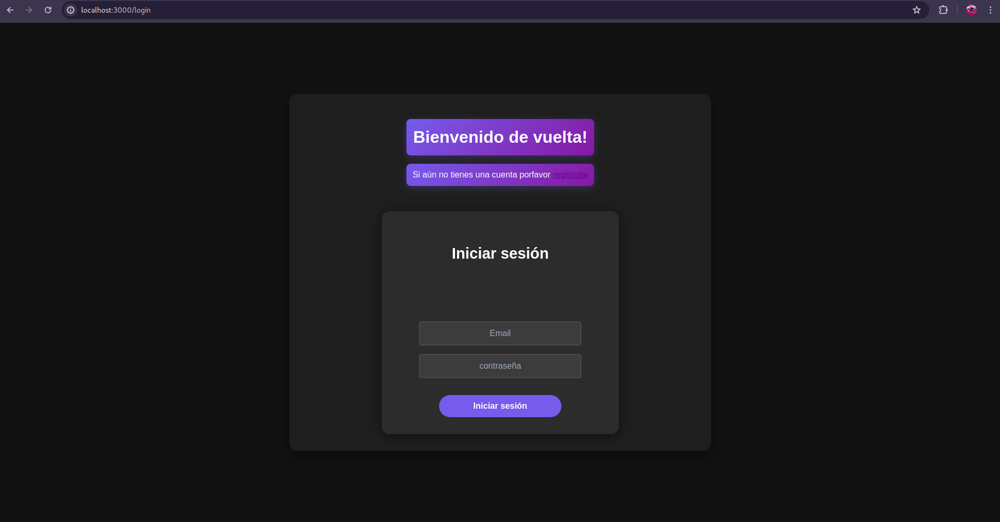

# DASHBOARD SOBRE LA CALIFICACIÓN DE LIBROS VENDIDOS EN AMAZON
 
###  Descripción:
Este es un proyecto hecho con nodejs y myql que crea un dashboard de una base de datos en donde esta almacenada información sobre los libros que se venden en amazon books.  
La base de datos se descargo de [aquí](https://www.kaggle.com/datasets/khushikhushikhushi/amazon-bestselling-books)




###  Integrantes

 - [Fausto Medina](https://github.com/Harico04)
 - [Joaquin Sotelo](https://github.com/JoaquinSotel0) 
 - [Manuel Gortarez](https://github.com/Mgb64) 
 - [Alan Torres](https://github.com/TumbadoBoy0604) 
 - [Rogelio Peralta](https://github.com/rgperalta04) 
 - [Ernesto Carrasco](https://github.com/jesuscarra) 
 - [Ricardo Peña](https://github.com/RemilZarza)
 - [Ian Zepeda](https://github.com/I4NzG)

### Requerimientos
1. Necesitarás instalar dos bases de datos para el proyecto, estas estarán dentro del repositorio en formato .sql, importarlas en MySQL. Una opción recomendable es hacerlo con XAAMP. Estas son:
   - AmazonBooks.sql
   - nodejs-login.sql
Las puedes encontrar dentro del repositorio.

2. NodeJS v20.12.2

3. MariaDB v10.4.32

### Instrucciones
1. Primeramente necesitamos clonar el repositorio.

    ```git clone https://github.com/Proyecto-ingenieria-de-software-BAMX/BAMX.git```

 2. Una vez dentro de la carpeta del repositorio ejecutaremos el siguiente comando para instalar  
   todas nuestras dependencias necesarias para el proyecto.
   
     ```npm install```

3.  Ahora corremos el proyecto ejecutando el siguiente script.

     ```npm run devStart```
     
4. Por último entramos al puerto 3000 en nuestro navegador de preferencia.

   ```localhost:3000```
      
